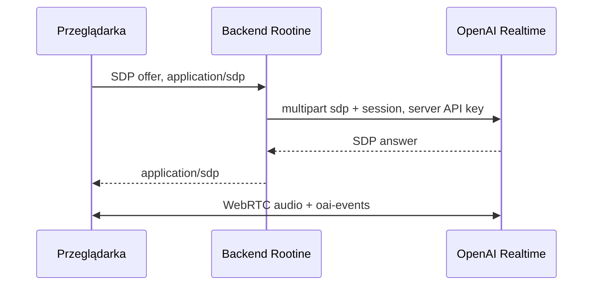

# ADR 0001: Rootine Assistant przez WebRTC i kontrolowane narzędzia lokalne

- Status: zaakceptowany
- Data: 2026-08-02
- Właściciel decyzji: Rootine

## Kontekst

Rootine jest aplikacją local-first. Dane użytkownika są utrzymywane przez istniejące workspace’y, repozytoria i serwisy domenowe w przeglądarce. Asystent ma umożliwiać rozmowę głosową i tekstową, odczytywać ograniczone fragmenty tych danych, wykonywać bezpieczne operacje oraz prezentować wyniki bez tworzenia drugiej, konkurencyjnej warstwy logiki biznesowej.

Integracja wymaga jednocześnie:

- niskiej latencji rozmowy głosowej;
- zachowania `OPENAI_API_KEY` wyłącznie po stronie serwera;
- kontroli dostępu do lokalnych danych per moduł i per read/write;
- jednoznacznej walidacji argumentów oraz wyników narzędzi;
- jawnego potwierdzania operacji o większym wpływie;
- braku arbitralnego kodu generowanego przez model;
- działania bez własnej serwerowej bazy danych Rootine.

## Decyzja

### 1. Transport przeglądarkowy: WebRTC

Klient używa `RTCPeerConnection` do mediów i kanału `oai-events` do zdarzeń Realtime. Własny endpoint `/api/assistant/realtime-session` przyjmuje SDP offer i przez zunifikowany interfejs OpenAI wywołuje `POST /v1/realtime/calls` z multipart `sdp` + `session`. Do przeglądarki wraca wyłącznie SDP answer.

Dlaczego:

- OpenAI rekomenduje WebRTC dla klientów przeglądarkowych ze względu na stabilniejsze media i niższą warstwę obsługi audio niż ręczny WebSocket;
- mikrofon i zdalne audio pozostają natywnymi `MediaStream`;
- data channel zapewnia aktualne zdarzenia rozmowy i function calling;
- zunifikowany endpoint jest prostszy od osobnego obiegu ephemeral tokenów i nie ujawnia standardowego klucza API.

Konsekwencje:

- backend znajduje się na krytycznej ścieżce inicjalizacji, ale nie na ścieżce audio po zestawieniu;
- czysty Vite nie wystarcza do pełnego lokalnego uruchomienia;
- przeglądarka musi wspierać WebRTC, media devices i secure context dla mikrofonu;
- twarde limity aktywnego połączenia wymagają w przyszłości sideband/server controls.

### 2. Model nie otrzymuje bezpośredniego dostępu do storage

OpenAI otrzymuje wyłącznie zamknięte definicje funkcji. Function call trafia do `AssistantToolExecutor`, który kolejno wykonuje:

1. parsowanie JSON;
2. walidację input schema Zod;
3. kontrolę feature flags i scope’ów;
4. politykę ryzyka i potwierdzenia;
5. wywołanie istniejącej metody domenowej;
6. walidację output schema;
7. redakcję Privacy Mode;
8. odesłanie `function_call_output` dla tego samego `call_id`.

Model nie otrzymuje API do odczytu dowolnego klucza `localStorage`, pełnego dumpu workspace ani możliwości wskazania ścieżki zapisu.

Dlaczego:

- serwisy domenowe zachowują inwarianty, migracje, persist-and-verify, eventy i Undo;
- minimalne query ograniczają przypadkową ekspozycję danych;
- exact ID, sesyjny rejestr pochodzenia i jawne narzędzia eliminują zgadywanie rekordów;
- kod wykonawczy, a nie prompt, pozostaje granicą bezpieczeństwa.

Konsekwencje:

- każde nowe zachowanie wymaga jawnego narzędzia i testów;
- model może poprosić o niedozwolone narzędzie, ale executor zwróci `PERMISSION` lub `UNSUPPORTED`;
- dane i narzędzia są lokalne dla bieżącej przeglądarki, bez synchronizacji serwerowej.

### 3. Generative UI korzysta wyłącznie z zamkniętego katalogu paneli

Model może wybrać typ panelu, kontrolowany layout i identyfikatory wcześniej zwróconych encji. Nie może generować HTML, JSX, CSS, SVG, klas Tailwind ani nazwy dowolnego komponentu.

Każdy widok i panel przechodzi przez ścisły schemat Zod. Renderer mapuje skończony katalog typów na utrzymywane przez aplikację komponenty z semantyką, obsługą klawiatury, stanami pustymi, potwierdzeniem, błędem i Undo.

Dlaczego:

- arbitrary UI od modelu tworzyłoby ryzyko XSS, niespójności wizualnej i niedostępnych interakcji;
- zamknięty katalog pozwala testować schemat, redakcję i każdą akcję;
- model opisuje intencję prezentacji, a aplikacja zachowuje odpowiedzialność za wygląd i zachowanie.

Konsekwencje:

- nowy wzorzec prezentacyjny wymaga jawnego typu panelu i implementacji renderera;
- elastyczność jest celowo ograniczona do layoutów oraz kontrolowanych envelope’ów `metrics`, `items`, `actions` i pól specjalizowanych;
- maksymalnie sześć paneli chroni czytelność i koszt kontekstu.

### 4. Brak narzędzi destrukcyjnych

Pierwsza wersja nie rejestruje usuwania ani nieodwracalnych operacji. `AssistantToolRegistry` odrzuca definicję z ryzykiem `destructive`, a permission layer niezależnie odrzuca jej wykonanie.

Zapisy dzielą się na:

- `reversible_write` — zapis z kompensacją i krótkim tokenem Undo;
- `confirmed_write` — jawna decyzja użytkownika, a po zapisie także Undo.

Dlaczego:

- rozmowa może być błędnie rozpoznana, przerwana lub niejednoznaczna;
- potwierdzenie nie usuwa ryzyka nieodwracalnej utraty danych;
- obecne domeny pozwalają osiągnąć główne scenariusze przez zmianę statusu, terminu lub utworzenie odwracalnego rekordu.

Konsekwencje:

- polecenia usunięcia są odrzucane lub wymagają ręcznego wykonania poza asystentem;
- dodanie destrukcyjnego narzędzia wymaga nowego ADR, modelu odzyskiwania danych i niezależnego security review;
- samo dodanie potwierdzenia nie jest wystarczającym uzasadnieniem.

## Odrzucone alternatywy

### WebSocket bezpośrednio z przeglądarki

Odrzucono z powodu gorszego dopasowania do przeglądarkowych mediów i ryzyka przeniesienia standardowego klucza API do klienta. WebSocket może być właściwy dla połączeń serwer-serwer, nie dla obecnego voice UI.

### Ephemeral client secret jako podstawowy przepływ

Jest oficjalnie wspierany, ale zunifikowany `/v1/realtime/calls` jest prostszy dla obecnej funkcji serverless: jeden request przenosi SDP i konfigurację. Ephemeral token pozostaje możliwą alternatywą, gdy topology inicjalizacji się zmieni.

### Wykonywanie wszystkich tool calls na backendzie

Odrzucono w MVP, ponieważ dane domenowe są lokalne dla przeglądarki. Wymagałoby to synchronizacji, serwerowej tożsamości użytkownika i nowego źródła prawdy. Sideband może w przyszłości obsłużyć serwerowe polityki lub narzędzia posiadające sekrety, ale nie zastępuje obecnych lokalnych serwisów.

### Bezpośredni dostęp modelu do storage

Odrzucono, ponieważ omijałby schematy, uprawnienia, minimalizację danych, migracje, domain events, potwierdzenia i Undo.

### Dowolny kod generatywnego UI

Odrzucono z powodów bezpieczeństwa, dostępności, przewidywalności i utrzymania design systemu.

### Destrukcyjne operacje z pojedynczym potwierdzeniem

Odrzucono. Błąd ASR, wybór złego rekordu lub nieaktualny kontekst mogą nadal doprowadzić do trwałej utraty danych.

## Wymagania operacyjne

- produkcja pozostaje wyłączona bez jawnego `ROOTINE_ASSISTANT_ENABLED=true`;
- `OPENAI_API_KEY` jest sekretem serwerowym i nigdy nie ma prefiksu `VITE_`;
- endpoint wymaga dokładnej allowlisty originów;
- opcjonalny Bearer token może chronić prywatny deployment, ale publiczna produkcja wymaga rzeczywistego auth;
- pamięciowy rate limit jest tylko warstwą pomocniczą; produkcja wymaga limitu rozproszonego/WAF;
- limity kosztu i alerty providera są obowiązkowe;
- audio, transkrypty, SDP i tool payloady nie są logowane ani utrwalane przez Rootine;
- narzędzia wrażliwe podlegają scope’om i redakcji Privacy Mode;
- testy używają `MockRealtimeTransport` oraz mockowanego upstreamu, nigdy live API.

## Skutki decyzji

Pozytywne:

- niski latency voice-to-voice;
- brak klucza OpenAI w bundle;
- jedna ścieżka logiki domenowej dla UI i asystenta;
- audytowalne narzędzia i deterministyczne panele;
- domyślny brak destrukcji, potwierdzenia i konflikt-safe Undo;
- możliwość testowania całej orkiestracji bez sieci.

Negatywne:

- wdrożenie potrzebuje działającego runtime API, auth i ochrony kosztowej;
- rate limit instancyjny nie wystarcza w skali;
- client-side timery nie są twardym limitem złośliwego klienta;
- lokalne tool execution nie działa na danych z innego urządzenia;
- każdy nowy tool i panel wymaga jawnego kodu, schematu i testów.

## Źródła

- [OpenAI Realtime API with WebRTC](https://developers.openai.com/api/docs/guides/realtime-webrtc)
- [OpenAI Realtime conversations](https://developers.openai.com/api/docs/guides/realtime-conversations)
- [OpenAI Realtime tools](https://developers.openai.com/api/docs/guides/realtime-mcp)
- [OpenAI Realtime server controls](https://developers.openai.com/api/docs/guides/realtime-server-controls)
