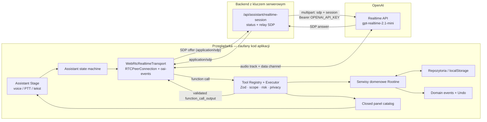
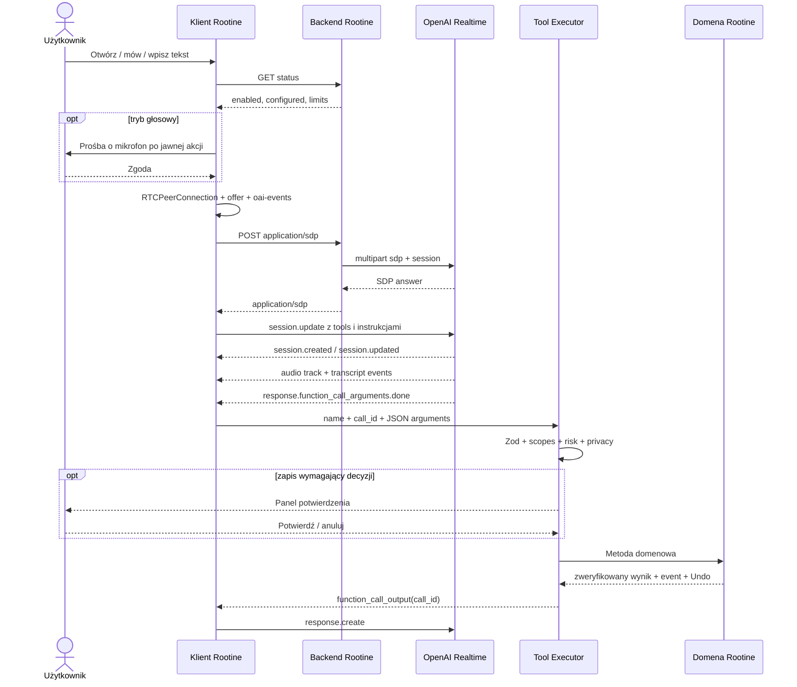

# Rootine Assistant

Rootine Assistant jest lokalnym, kontekstowym interfejsem głosowym i tekstowym do danych Rootine. Model prowadzi rozmowę i proponuje wywołania narzędzi, ale nie otrzymuje bezpośredniego dostępu do `localStorage`, repozytoriów ani komponentów UI. Każdy odczyt i zapis przechodzi przez kontrolowany rejestr narzędzi, walidację Zod, uprawnienia, politykę ryzyka i istniejące serwisy domenowe.

Warstwa serwerowa służy wyłącznie do bezpiecznego zestawienia sesji OpenAI Realtime. Klucz OpenAI nigdy nie trafia do przeglądarki. Aktualna integracja używa kosztowo zoptymalizowanego modelu `gpt-realtime-2.1-mini`, głosu `marin` i zunifikowanego endpointu WebRTC `POST https://api.openai.com/v1/realtime/calls`, zgodnie z oficjalnym [przewodnikiem WebRTC](https://developers.openai.com/api/docs/guides/realtime-webrtc).

## Architektura



Skrócony przepływ z granicami zaufania:

```text
jawna akcja użytkownika
  -> GET status backendu
  -> opcjonalna zgoda na mikrofon
  -> SDP offer z przeglądarki
  -> własny backend (origin/token/rate-limit/body-limit)
  -> OpenAI /v1/realtime/calls z kluczem serwerowym
  -> SDP answer
  -> audio przez WebRTC, zdarzenia przez kanał oai-events
  -> function call
  -> walidacja + permissions + confirmation policy
  -> serwis domenowy + zapis i weryfikacja
  -> domain event + token Undo
  -> zamknięty panel + function_call_output
```

Najważniejsze granice:

- backend nie wykonuje narzędzi domenowych i nie ma dostępu do lokalnych danych użytkownika;
- model nie otrzymuje całego magazynu danych — wyłącznie argumenty i ograniczone wyniki narzędzi;
- UI nie renderuje HTML, JSX, CSS ani nazw komponentów pochodzących od modelu;
- serwis domenowy, a nie model lub komponent asystenta, jest źródłem prawdy o powodzeniu zapisu;
- `Origin` i CORS ograniczają przeglądarki, ale nie są uwierzytelnianiem.

## Mapa implementacji

| Obszar | Lokalizacja |
| --- | --- |
| Kontrakt i implementacja transportu | `src/assistant/realtime/` |
| Stan i orkiestracja sesji | `src/assistant/runtime/` |
| Ustawienia i domyślne uprawnienia | `src/assistant/config/` |
| Rejestr i wykonanie narzędzi | `src/assistant/tools/` |
| Potwierdzenia | `src/assistant/confirmations/` |
| Redakcja prywatności | `src/assistant/privacy/` |
| Schematy, fabryka i katalog paneli | `src/assistant/panels/` |
| Sterowanie Assistant Stage | `src/assistant/presentation/` |
| UI asystenta | `src/assistant/ui/` |
| Serwisy domenowe i Undo | `src/domain/` |
| Wspólny handler sesji | `api/_shared/realtime-session.ts` |
| Vercel Edge Function | `api/assistant/realtime-session.ts` |
| Cloudflare Worker | `worker/index.ts` |
| Cloudflare Pages Function | `functions/api/assistant/realtime-session.ts` |

## Konfiguracja środowiska

Wszystkie poniższe zmienne są serwerowe. Nie wolno tworzyć odpowiedników `VITE_OPENAI_*` ani osadzać wartości w bundle przeglądarki.

| Zmienna | Wymagana | Domyślna wartość / zakres | Znaczenie |
| --- | --- | --- | --- |
| `OPENAI_API_KEY` | gdy funkcja jest włączona | brak | Standardowy klucz API używany wyłącznie przez backend. |
| `OPENAI_REALTIME_MODEL` | nie | `gpt-realtime-2.1-mini` | Kosztowo zoptymalizowany model przekazywany w konfiguracji sesji. |
| `OPENAI_REALTIME_VOICE` | nie | `marin` | Początkowy głos sesji; klient udostępnia też `cedar`. |
| `ROOTINE_ASSISTANT_ENABLED` | tak, aby włączyć | `false` | Tylko wartość `true` otwiera tworzenie sesji. Brak zmiennej oznacza wyłączenie. |
| `ROOTINE_ASSISTANT_ALLOWED_ORIGINS` | gdy funkcja jest włączona | brak | Rozdzielona przecinkami lista dokładnych originów, np. `https://rootine.example`. Bez ścieżek i wildcardów. |
| `ROOTINE_ASSISTANT_ACCESS_TOKEN` | nie | brak | Opcjonalny prywatny kod. Jeśli istnieje, klient musi wysłać `Authorization: Bearer <token>`. To nie jest klucz OpenAI. |
| `ROOTINE_ASSISTANT_MAX_SESSION_MINUTES` | nie | `10`, clamp `1–60` | Limit zwracany klientowi; klient stosuje mniejszą wartość z ustawienia lokalnego i serwera. |
| `ROOTINE_ASSISTANT_IDLE_TIMEOUT_SECONDS` | nie | `120`, clamp `15–3600` | Limit bezczynności zwracany klientowi. |
| `ROOTINE_ASSISTANT_UPSTREAM_TIMEOUT_MS` | nie | `12000`, clamp `1000–30000` | Timeout zestawienia połączenia z OpenAI. |
| `ROOTINE_ASSISTANT_RATE_LIMIT` | nie | `5`, clamp `1–100` | Liczba prób utworzenia sesji na IP w jednym oknie, lokalnie dla instancji runtime. |
| `ROOTINE_ASSISTANT_RATE_WINDOW_SECONDS` | nie | `60`, clamp `10–3600` | Długość okna instancyjnego rate limitu. |

Szablony znajdują się w `.env.example` i `.dev.vars.example`. Pliki `.env*` oraz `.dev.vars*`, poza szablonami, są ignorowane przez Git.

Minimalna konfiguracja prywatnego środowiska:

```dotenv
ROOTINE_ASSISTANT_ENABLED=true
OPENAI_API_KEY=sk-...
OPENAI_REALTIME_MODEL=gpt-realtime-2.1-mini
OPENAI_REALTIME_VOICE=marin
ROOTINE_ASSISTANT_ALLOWED_ORIGINS=https://rootine.example
ROOTINE_ASSISTANT_ACCESS_TOKEN=długi-losowy-sekret
ROOTINE_ASSISTANT_MAX_SESSION_MINUTES=10
ROOTINE_ASSISTANT_IDLE_TIMEOUT_SECONDS=120
```

`ROOTINE_ASSISTANT_ACCESS_TOKEN` jest dodatkową bramką dla prywatnego wdrożenia. Nie zastępuje logowania użytkownika, kontroli dostępu platformy ani rozproszonego rate limitu.

## Uruchomienie lokalne

### Sam Vite

```powershell
npm install
npm run dev
```

Czysty Vite hostuje frontend, ale **nie hostuje** `api/`, `worker/` ani `functions/`. W takim trybie `GET /api/assistant/realtime-session` może zwrócić HTML fallbacku SPA albo 404, a UI prawidłowo pokaże backend asystenta jako niedostępny. Nie proxy’uj przeglądarki bezpośrednio do OpenAI.

### Vercel lokalnie

1. Skopiuj `.env.example` do ignorowanego `.env.local` i ustaw klucz, flagę oraz dokładny origin wypisany przez CLI.
2. Uruchom:

   ```powershell
   npx vercel dev
   ```

3. Otwórz adres podany przez Vercel CLI. Handler `api/assistant/realtime-session.ts` działa jako Edge Function.

Vercel CLI nie jest zależnością projektu; `npx` może pobrać go przy pierwszym uruchomieniu i poprosić o konfigurację projektu.

### Cloudflare Worker lokalnie

1. Skopiuj `.dev.vars.example` do `.dev.vars`.
2. Ustaw `ROOTINE_ASSISTANT_ENABLED=true`, klucz i origin procesu Wrangler, domyślnie `http://localhost:8787`.
3. Zbuduj assety i uruchom Worker:

   ```powershell
   npm run build
   npx wrangler dev
   ```

Worker obsługuje `/api/*` przed assetami, a pozostałe trasy serwuje z `dist` z fallbackiem SPA. Po zmianach frontendu trzeba ponownie zbudować `dist` lub uruchomić osobny watch bundlera.

### Cloudflare Pages lokalnie

Jeżeli wdrożenie używa Pages Functions zamiast Workera:

```powershell
npm run build
npx wrangler pages dev dist
```

Adapter znajduje się w `functions/api/assistant/realtime-session.ts`. Nie uruchamiaj jednocześnie Workera i Pages jako dwóch konkurencyjnych produkcyjnych punktów wejścia; wybierz jeden topology dla danego hosta.

## Wdrożenie

### Vercel

- pozostaw framework Vite, build `npm run build` i katalog `dist` z `vercel.json`;
- ustaw zmienne w Project Settings osobno dla Preview i Production;
- `ROOTINE_ASSISTANT_ALLOWED_ORIGINS` musi zawierać dokładny origin danego deploymentu; preview wymaga własnego originu albo świadomie zarządzanej listy;
- `OPENAI_API_KEY` i opcjonalny access token oznacz jako sekrety;
- dodaj platformową ochronę dostępu i rozproszony rate limit/WAF przed włączeniem flagi produkcyjnej.

### Cloudflare Worker

- sekrety ustaw przez dashboard albo CLI:

  ```powershell
  npx wrangler secret put OPENAI_API_KEY
  npx wrangler secret put ROOTINE_ASSISTANT_ACCESS_TOKEN
  ```

- pozostałe wartości ustaw jako Variables w środowisku Workera;
- wykonaj `npm run build`, a następnie właściwy dla procesu release `npx wrangler deploy`;
- skonfiguruj Cloudflare Access lub równoważną autoryzację oraz trwały rate limit, np. regułę WAF albo licznik oparty o usługę współdzieloną między instancjami.

### Cloudflare Pages

- ustaw Environment variables/secrets dla Preview i Production w ustawieniach Pages;
- upewnij się, że katalog `functions/` jest dołączony do deploymentu;
- dodaj ochronę dostępu i rozproszony rate limit na warstwie Cloudflare;
- sprawdź, czy `/api/assistant/realtime-session` trafia do Function, a nie do fallbacku `index.html`.

### Checklista produkcyjna

- `ROOTINE_ASSISTANT_ENABLED` pozostaje `false`, dopóki wszystkie kolejne punkty nie są gotowe;
- klucz OpenAI jest ograniczony do właściwego projektu i ma skonfigurowane limity wydatków;
- istnieje uwierzytelnianie użytkownika albo platformowa ochrona dostępu;
- istnieje rozproszony rate limit niezależny od pamięci instancji;
- allowlista originów nie zawiera wildcardów ani nieużywanych preview URL-i;
- nagłówki i logi platformy nie zapisują `Authorization`, SDP, transkryptów ani treści tool calls;
- smoke test sprawdza status i błędne żądania bez tworzenia płatnej sesji;
- alerty obejmują wzrost 429/5xx i wydatków, bez treści rozmów.

## Kontrakt `/api/assistant/realtime-session`

Każda odpowiedź ma `Cache-Control: no-store`, `X-Content-Type-Options: nosniff` i `X-Request-ID`. Dla dozwolonego cross-origin endpoint zwraca `Access-Control-Allow-Origin` dla konkretnego originu, nigdy `*`.

### GET — status

GET nie tworzy sesji i nie wykonuje płatnego wywołania OpenAI. Przykład:

```http
GET /api/assistant/realtime-session
Accept: application/json
```

```json
{
  "status": "ok",
  "enabled": true,
  "configured": true,
  "requiresAccessToken": true,
  "model": "gpt-realtime-2.1-mini",
  "voice": "marin",
  "limits": {
    "idleTimeoutSeconds": 120,
    "maxRequestBytes": 65536,
    "maxSessionMinutes": 10,
    "rateLimit": 5,
    "rateWindowSeconds": 60
  },
  "rateLimitScope": "instance"
}
```

Status nie zwraca klucza OpenAI, access tokenu ani listy originów. `configured` oznacza obecność klucza i co najmniej jednego poprawnego originu. UI mapuje wynik na `available`, `disabled`, `misconfigured` lub `unreachable`.

### OPTIONS — preflight

Preflight jest potrzebny wyłącznie przy cross-origin. Dla dozwolonego originu zwraca `204` oraz:

```http
Access-Control-Allow-Methods: GET, POST, OPTIONS
Access-Control-Allow-Headers: Authorization, Content-Type
```

Same-origin pozostaje zalecanym i domyślnym topology.

### POST — wymiana SDP

Żądanie klienta:

```http
POST /api/assistant/realtime-session
Origin: https://rootine.example
Content-Type: application/sdp
Accept: application/sdp, application/json
Authorization: Bearer <opcjonalny prywatny token>

v=0
...
```

Warunki:

- body jest surowym SDP w UTF-8, nie JSON-em;
- maksymalny rozmiar to 65 536 bajtów, niezależnie od deklarowanego `Content-Length`;
- `Origin` musi dokładnie pasować do allowlisty;
- Bearer jest wymagany tylko wtedy, gdy ustawiono `ROOTINE_ASSISTANT_ACCESS_TOKEN`;
- instancyjny rate limit jest liczony na adres klienta;
- upstream jest przerywany po skonfigurowanym timeoutcie.

Backend tworzy `FormData` z polami `sdp` i `session`, po czym wywołuje:

```http
POST https://api.openai.com/v1/realtime/calls
Authorization: Bearer <OPENAI_API_KEY>
```

Początkowa sesja używa aktualnego kształtu konfiguracji:

```json
{
  "type": "realtime",
  "model": "gpt-realtime-2.1-mini",
  "output_modalities": ["audio"],
  "audio": {
    "input": {
      "format": { "type": "audio/pcm", "rate": 24000 },
      "noise_reduction": { "type": "near_field" },
      "transcription": { "model": "gpt-4o-mini-transcribe", "language": "pl" },
      "turn_detection": {
        "type": "semantic_vad",
        "eagerness": "auto",
        "create_response": true,
        "interrupt_response": true
      }
    },
    "output": {
      "format": { "type": "audio/pcm" },
      "voice": "marin"
    }
  }
}
```

Aktualne API przyjmuje `output_modalities: ["audio"]` albo `output_modalities: ["text"]`; nie używamy starszego wariantu `['audio', 'text']`. Tryb audio dostarcza osobny transkrypt odpowiedzi. Po otwarciu kanału klient wysyła `session.update` z pełnymi instrukcjami Rootine, listą narzędzi, właściwą modalnością i VAD zależnym od trybu mikrofonu. Zobacz [Realtime conversations](https://developers.openai.com/api/docs/guides/realtime-conversations) i [Voice activity detection](https://developers.openai.com/api/docs/guides/realtime-vad).

Sukces:

```http
HTTP/1.1 200 OK
Content-Type: application/sdp
Cache-Control: no-store
X-Request-ID: ...

v=0
...
```

### Błędy

Błąd ma bezpieczny kształt:

```json
{
  "error": "origin_denied",
  "message": "Origin is not allowed.",
  "requestId": "..."
}
```

| HTTP | `error` | Znaczenie |
| --- | --- | --- |
| 400 | `invalid_sdp` | Puste body albo niepoprawny UTF-8. |
| 401 | `unauthorized` | Brak lub błędny opcjonalny Bearer token. |
| 403 | `origin_denied` | Brak originu dla POST albo origin spoza allowlisty. |
| 405 | `method_not_allowed` | Metoda inna niż GET, POST lub OPTIONS. |
| 413 | `payload_too_large` | SDP przekracza 64 KiB. |
| 415 | `unsupported_media_type` | Content-Type inny niż `application/sdp`. |
| 429 | `rate_limited` | Instancyjny limit prób; odpowiedź zawiera `Retry-After`. |
| 502 | `upstream_error` | OpenAI odrzucił zestawienie; szczegóły upstreamu są redagowane. |
| 502 | `invalid_upstream_response` | Pusta odpowiedź SDP. |
| 502 | `upstream_unavailable` | Błąd sieci do providera. |
| 503 | `assistant_disabled` | Flaga nie ma wartości `true`. |
| 503 | `assistant_misconfigured` | Brak klucza lub poprawnej allowlisty. |
| 504 | `upstream_timeout` | Upstream przekroczył timeout. |

Handler nie loguje SDP, audio, transkryptów, argumentów narzędzi, odpowiedzi narzędzi ani sekretów. Nie przekazuje też treści błędu OpenAI do klienta.

## Lifecycle WebRTC



### Zestawienie

1. Konstrukcja transportu jest bez efektów ubocznych.
2. Mikrofon jest pobierany wyłącznie po jawnej akcji i tylko dla `connect({ voice: true })`.
3. Klient dodaje track audio albo transceiver `recvonly` dla trybu tekstowego.
4. Tworzony jest kanał danych `oai-events`.
5. Po lokalnym offer i krótkim oczekiwaniu na ICE klient wysyła SDP do własnego backendu.
6. Po `setRemoteDescription` klient czeka na otwarcie data channel, a następnie wysyła `session.update`.

### Tryby wejścia

**Rozmowa:** `semantic_vad` wykrywa początek i koniec wypowiedzi, automatycznie tworzy odpowiedź i zezwala na przerwanie aktywnej odpowiedzi.

**Push-to-talk:** klient ustawia `turn_detection: null`, a lokalny track mikrofonu pozostaje `disabled` poza świadomym przytrzymaniem. Naciśnięcie czyści bufor wejścia, przerywa aktywną odpowiedź (`response.cancel` oraz `output_audio_buffer.clear`) i dopiero wtedy włącza track; zwolnienie najpierw wyłącza track, a potem wysyła `input_audio_buffer.commit` i `response.create`. `pointercancel`, utrata capture/fokusu, `Escape` lub utrata okna wyłączają track i czyszczą bufor bez `commit`.

**Tekst:** klient wysyła `conversation.item.create` z `input_text`, następnie `response.create`. Modalność sesji może zostać ustawiona na `["text"]`, więc mikrofon nie jest wymagany.

**Przerwanie:** klient wysyła `response.cancel`, czyści nieodtworzone audio przez `output_audio_buffer.clear`, zatrzymuje lokalne odtwarzanie i oznacza turn jako ignorowany. Późne eventy z anulowanego turnu lub starej sesji są odrzucane przez tombstones state machine.

### Zdarzenia

Obsługiwane zdarzenia klient → OpenAI:

- `session.update`;
- `conversation.item.create` z `input_text`;
- `conversation.item.create` z `function_call_output` i tym samym `call_id`;
- `response.create` i `response.cancel`;
- `input_audio_buffer.clear` i `input_audio_buffer.commit`;
- `output_audio_buffer.clear`.

Obsługiwane zdarzenia OpenAI → klient:

- `session.created`, `session.updated`;
- `input_audio_buffer.speech_started`, `input_audio_buffer.speech_stopped`, `input_audio_buffer.committed`;
- `conversation.item.input_audio_transcription.delta`, `.completed`, `.failed`;
- `response.created`;
- `response.output_text.delta`, `.done`;
- `response.output_audio_transcript.delta`, `.done`;
- `response.function_call_arguments.done`;
- `response.done`, `response.error`, `error`;
- `rate_limits.updated`.

Audio odpowiedzi przy WebRTC przychodzi jako zdalny media track, a nie jako dekodowane ręcznie chunki w data channel. Function call jest wykonywany po finalnym `response.function_call_arguments.done`; runtime potrafi też odczytać finalny call z `response.done` i deduplikuje `call_id`. Szczegóły function calling opisuje oficjalny [przewodnik Realtime tools](https://developers.openai.com/api/docs/guides/realtime-mcp).

### Stan, timeouty i cleanup

State machine używa stanów: `disabled`, `idle`, `requesting_permission`, `connecting`, `listening`, `user_speaking`, `processing`, `executing_tool`, `awaiting_confirmation`, `assistant_speaking`, `interrupted`, `reconnecting`, `error`, `closing`.

- limit sesji i idle timeout to minimum wartości klienta oraz wartości ogłoszonej przez backend;
- przy odzyskiwalnym błędzie runtime wykonuje maksymalnie dwie automatyczne próby reconnect z krótkim backoffem;
- zamknięcie abortuje negocjację, czyści timery i potwierdzenia, usuwa listenery, zamyka data channel i peer connection;
- wszystkie lokalne tracki mikrofonu są zatrzymywane;
- graf analizy Web Audio jest odłączany, `AudioContext` zamykany, a zdalny element audio czyszczony;
- transkrypt, aktualny widok i stan sesji są resetowane.

Oficjalny limit sesji Realtime wynosi obecnie 60 minut; Rootine domyślnie zamyka sesję po 10 minutach. Głosu nie można zmienić po pierwszym wygenerowanym audio — zmiana głosu powinna rozpocząć nową sesję. Zobacz [Realtime conversations](https://developers.openai.com/api/docs/guides/realtime-conversations).

## Ustawienia, feature flags i scope’y

Efektywna dostępność wymaga jednocześnie gotowego backendu i włączonego `assistantEnabled` po stronie klienta.

### Domyślne ustawienia klienta

| Ustawienie | Domyślnie | Działanie |
| --- | --- | --- |
| `assistantEnabled` | `true` | Lokalny przełącznik UI; nie omija serwerowego `ROOTINE_ASSISTANT_ENABLED`. |
| `voiceEnabled` | `true` | Zezwala na odpowiedzi audio. |
| `assistantWritesEnabled` | `true` | Globalna bramka wszystkich zapisów. |
| `assistantPanelsEnabled` | `true` | Zezwala na Assistant Stage i panele; po wyłączeniu pozostaje rozmowa tekstowa/głosowa bez generatywnego widoku. |
| `assistantFinanceEnabled` | `false` | Dodatkowa bramka finansów. |
| `assistantNotesEnabled` | `false` | Dodatkowa bramka notatek. |
| `assistantDebugEnabled` | `false` | Lokalny debug stanu i nazw eventów, bez treści rozmowy. |
| `diagnosticsEnabled` | `true` | Lokalna diagnostyka techniczna bez audio, transkryptów i tool payloadów. |
| `voice` | `marin` | Dozwolone wartości UI: `marin`, `cedar`. |
| `microphoneMode` | `conversation` | Alternatywa: `push_to_talk`. |
| `maxSessionMinutes` | `10` | Dozwolone w UI: 5, 10, 15, 30; runtime stosuje minimum z limitem serwera. |
| `idleTimeoutSeconds` | `120` | Schemat klienta: 30–600 sekund. |
| `shortcut` | `mod+space` | `Ctrl+Space` / `Cmd+Space`. |
| `voicePrivacy` | `hide_sensitive` | `standard`, `hide_sensitive`, `silent_sensitive`. |
| `autoRunReversibleWrites` | `true` | Gdy `false`, także odwracalne zapisy wymagają potwierdzenia. |
| `rememberCommands` | `false` | Opt-in: do 10 ostatnich komend, maks. 500 znaków każda, w `localStorage`. |

Ustawienia są walidowane i przechowywane pod `rootine.assistant.settings.v1`. Opcjonalny kod dostępu jest przechowywany tylko w `sessionStorage` pod `rootine.assistant.access-token`, a nie w trwałych ustawieniach. Historia komend ma osobny klucz i można ją wyczyścić w ustawieniach.

### Domyślne uprawnienia scope’ów

| Scope | Moduł | Odczyt | Zapis | Uwagi |
| --- | --- | ---: | ---: | --- |
| `today` | Dzisiaj | tak | nie | Agregat respektuje też uprawnienia modułów składowych. |
| `tasks` | Zadania | tak | tak | |
| `habits` | Nawyki | tak | tak | |
| `nutrition` | Odżywianie | tak | tak | Commit posiłku zawsze wymaga potwierdzenia. |
| `body_data` | Dane ciała | nie | nie | Wrażliwe; Privacy Mode blokuje payload dla modelu. |
| `sport` | Sport | tak | tak | |
| `work` | Praca | tak | tak | Wrażliwe nazwy są redagowane w Privacy Mode. |
| `goals` | Cele | tak | tak | Aktualizacja postępu zawsze wymaga potwierdzenia. |
| `matters` | Sprawy i Podróże | tak | tak | Podróże używają scope’u `matters`. |
| `notes` | Notatki | nie | nie | Wymaga również `assistantNotesEnabled`. |
| `finance` | Finanse/Płatności | nie | nie | Wymaga również `assistantFinanceEnabled`; Privacy Mode blokuje kwoty. |
| `navigation` | Nawigacja | tak | nie | Zmienia trasę, nie dane domenowe. |
| `presentation` | Assistant Stage | tak | tak | Kontrolowane panele i mechanizm Undo; zapis dotyczy wyłącznie kontrolowanych akcji UI, nigdy danych domenowych ani dowolnego kodu. |

Executor sprawdza uprawnienia podczas każdego wywołania. Zapis wymaga jednocześnie prawa odczytu i zapisu danego zakresu, ponieważ asystent musi najpierw rozwiązać dokładny rekord. Samo otrzymanie przez model nazwy narzędzia nie daje prawa do jego wykonania.

Identyfikatory encji mają sesyjny rejestr pochodzenia. Zapis przyjmie tylko ID zwrócone wcześniej przez zwalidowane narzędzie, wskazane w bieżącym kontekście aplikacji albo jawnie wybrane z kontrolowanego panelu. Kandydaci z odpowiedzi `AMBIGUOUS` nie stają się autorytatywni przed wyborem; wybór głosowy obsługuje jednoznaczne liczebniki porządkowe i dokładną etykietę. Rejestr jest usuwany po zamknięciu lub zmianie sesji.

## Model ryzyka, potwierdzenia i Undo

| Ryzyko | Zachowanie |
| --- | --- |
| `read` | Odczyt lub efekt prezentacyjny; bez potwierdzenia, ale ze scope gate i redakcją. |
| `reversible_write` | Zapis z kompensacją. Domyślnie może wykonać się automatycznie; użytkownik może wymusić potwierdzanie wszystkich takich operacji. |
| `confirmed_write` | Zawsze tworzy panel decyzji i czeka na jawne potwierdzenie. |
| `destructive` | Niedozwolone. Registry odrzuca rejestrację, a permission layer odrzuca wykonanie. |

Potwierdzenie:

- jest przypisane do dokładnej sesji, turnu, `call_id` i narzędzia;
- pokazuje operację, rekord oraz — jeśli dostępne — wartość poprzednią i następną;
- wygasa po 45 sekundach;
- jest jednorazowe; zwykłe „tak” po wygaśnięciu nie wykonuje zmiany;
- bezpośrednio przed wykonaniem ponownie sprawdza bieżące scope’y, prawo odczytu/zapisu, pochodzenie ID, aktualny kontekst i Privacy Mode;
- anulowanie lub zamknięcie sesji usuwa oczekującą operację.

W jednym turnie wiele odczytów jest wykonywanych sekwencyjnie, wszystkie `function_call_output` są zwracane przed jednym `response.create`. Pakiet zawierający więcej niż jeden zapis jest w MVP odrzucany w całości kodem `UNSUPPORTED`; użytkownik musi wykonać i — jeśli wymagane — potwierdzić każdą zmianę osobno.

Zapis domenowy:

1. waliduje argumenty;
2. zapisuje przez istniejący workspace/repository;
3. odczytuje dane ponownie i weryfikuje rezultat;
4. emituje domain event;
5. rejestruje kompensację i zwraca `undoToken`;
6. dopiero wtedy UI i model otrzymują `success: true`.

Undo:

- token jest jednorazowy i domyślnie ważny 10 sekund;
- kompensacja sprawdza, czy rekord nadal ma stan oczekiwany po pierwotnej operacji;
- jeśli rekord zniknął albo zmienił się w międzyczasie, Undo kończy się `NOT_FOUND` lub `CONFLICT` zamiast nadpisywać nowsze dane;
- udane cofnięcie emituje `undo.applied` i może zwrócić nowy token operacji odwrotnej;
- tokeny żyją wyłącznie w pamięci bieżącego runtime i nie przetrwają reloadu.
- `eventId`, `undoToken` i czas ważności Undo nie są serializowane do modelu; pozostają w lokalnej warstwie prezentacji i odzyskiwania.

Szkic posiłku jest przechowywany w pamięci przez 30 minut. `create_meal_draft` i `update_meal_draft` nie zapisują wpisu w dzienniku. Dopiero `commit_meal`, po jawnym potwierdzeniu i ponownej walidacji źródłowych produktów, wykonuje zapis domenowy.

## Katalog narzędzi

Legenda: `R` = `read`, `RW` = `reversible_write`, `CW` = `confirmed_write`. Każdy input i output jest walidowany. Przy niejednoznacznym wyszukiwaniu narzędzie zwraca kandydatów zamiast zgadywać identyfikator.

### Dzisiaj, zadania i nawyki

| Tool | Scope | Ryzyko | Działanie / panel |
| --- | --- | --- | --- |
| `get_today_overview` | `today` | R | Liczniki i maks. 3 priorytety; `today_overview`. |
| `get_priority_tasks` | `tasks` | R | Ograniczona lista otwartych priorytetów; `priority_tasks`. |
| `get_urgent_tasks` | `tasks` | R | Otwarte zadania wysokiego priorytetu; `urgent_tasks`. |
| `get_overdue_items` | `tasks` | R | Zadania zaległe przed wskazaną datą; `overdue_items`. |
| `search_tasks` | `tasks` | R | Wyszukiwanie tytułów i doprecyzowanie ID; `task_candidates` lub `clarification`. |
| `get_tasks_for_date` | `tasks` | R | Zadania na dokładną datę; lista kandydatów. |
| `get_calendar_week` | `tasks` | R | Siedmiodniowe, ograniczone okno od `startDate`, z wystąpieniami cyklicznymi i filtrowaniem zakresów; `task_candidates`. |
| `get_calendar_conflicts` | `tasks` | R | Konflikty w tym samym oknie: identyczny start lub jawne nakładanie godzin; elementy całodniowe nie są zgadywane jako konflikt; `task_candidates`. |
| `create_task` | `tasks` | RW | Tworzy jedno zadanie; `action_result` + Undo. |
| `complete_task` | `tasks` | RW | Kończy zadanie po dokładnym ID; `action_result` + Undo. |
| `uncomplete_task` | `tasks` | RW | Otwiera ponownie zadanie; `action_result` + Undo. |
| `reschedule_task` | `tasks` | RW | Zmienia datę i opcjonalną godzinę; `action_result` + Undo. |
| `set_task_priority` | `tasks` | RW | Ustawia priorytet; `action_result` + Undo. |
| `get_habits_summary` | `habits` | R | Stan i streak na datę; `habits_summary`. |
| `complete_habit` | `habits` | RW | Kończy wystąpienie na dokładną datę; Undo. |
| `uncomplete_habit` | `habits` | RW | Otwiera ponownie wystąpienie; Undo. |

### Odżywianie i ciało

| Tool | Scope | Ryzyko | Działanie / panel |
| --- | --- | --- | --- |
| `get_nutrition_summary` | `nutrition` | R | Źródłowe kcal, makra, cele i woda; `nutrition_summary`. |
| `search_food_products` | `nutrition` | R | Przeszukuje katalog, nie wymyśla wartości; `clarification`. |
| `get_recent_meals` | `nutrition` | R | Ograniczona lista ostatnich niesamplowych posiłków. |
| `get_water_summary` | `nutrition` | R | Spożycie, cel i pozostała woda; `water_summary`. |
| `add_water` | `nutrition` | RW | Dodaje dodatnią liczbę ml; `action_result` + Undo. |
| `create_meal_draft` | `nutrition` | RW | Tworzy 30-minutowy szkic wyłącznie z katalogowych ID; `meal_draft`. |
| `update_meal_draft` | `nutrition` | RW | Aktualizuje niewygasły szkic; `meal_draft`. |
| `commit_meal` | `nutrition` | CW | Zapisuje potwierdzony szkic do dziennika; `confirmation`, potem `action_result` + Undo. |
| `get_body_summary` | `body_data` | R | Ostatnia waga i pomiary; `body_summary`, pełna blokada payloadu w Privacy Mode. |

### Sport i praca

| Tool | Scope | Ryzyko | Działanie / panel |
| --- | --- | --- | --- |
| `get_sport_summary` | `sport` | R | Dzisiejszy i nadchodzący plan z aktywnego cyklu; `sport_summary`. |
| `get_upcoming_workouts` | `sport` | R | Treningi w oknie do 60 dni; `upcoming_workouts`. |
| `search_workouts` | `sport` | R | Wyszukuje tytuły w aktywnym cyklu i zwraca ID. |
| `complete_workout` | `sport` | RW | Kończy dokładne wystąpienie treningu; Undo. |
| `reschedule_workout` | `sport` | RW | Przenosi wystąpienie na datę; Undo. |
| `create_workout` | `sport` | RW | Tworzy trening w dokładnym aktywnym cyklu; Undo. |
| `get_work_summary` | `work` | R | Otwarte/zaległe elementy i liczba projektów; `work_summary`. |
| `search_work_items` | `work` | R | Wyszukuje zadania z kontekstem projektu. |
| `create_work_item` | `work` | RW | Tworzy zadanie w dokładnym projekcie; Undo. |
| `complete_work_item` | `work` | RW | Kończy lub otwiera ponownie dokładny element; Undo. |

### Cele, sprawy i podróże

| Tool | Scope | Ryzyko | Działanie / panel |
| --- | --- | --- | --- |
| `get_goals_summary` | `goals` | R | Aktywne i zagrożone cele z postępem; `goal_summary`. |
| `get_goal_details` | `goals` | R | Szczegóły dokładnego goal ID; `goal_summary`. |
| `update_goal_progress` | `goals` | CW | Ustawia wartość lub delta postępu; zawsze `confirmation`, potem Undo. |
| `complete_milestone` | `goals` | RW | Kończy lub otwiera milestone; Undo. |
| `get_matters_summary` | `matters` | R | Otwarte i zaległe sprawy; `matter_summary`. |
| `search_matters` | `matters` | R | Wyszukuje sprawy do doprecyzowania; `matter_summary`/`clarification`. |
| `complete_matter` | `matters` | RW | Kończy lub otwiera sprawę; Undo. |
| `reschedule_matter` | `matters` | RW | Przenosi termin sprawy; Undo. |
| `get_travel_summary` | `matters` | R | Nadchodzące podróże bez szczegółowych budżetów; `matter_summary`. |
| `search_travel_tasks` | `matters` | R | Wyszukuje checklistę z kontekstem podróży. |
| `complete_travel_task` | `matters` | RW | Kończy lub otwiera element checklisty; Undo. |

### Notatki i finanse

| Tool | Scope | Ryzyko | Działanie / panel |
| --- | --- | --- | --- |
| `search_notes` | `notes` | R | Ograniczone, krótkie snippet’y; `note_results`. |
| `create_note` | `notes` | RW | Tworzy krótką notatkę lokalną; `action_result` + Undo. |
| `get_finance_summary` | `finance` | R | Ograniczone podsumowanie nieopłaconych pozycji; `finance_summary`. |
| `get_unpaid_items` | `finance` | R | Nieopłacone i cykliczne zobowiązania; `finance_summary`. |
| `mark_payment_paid` | `finance` | CW | Oznacza dokładną płatność opłaconą/nieopłaconą; zawsze potwierdzenie i Undo. |

### Prezentacja, nawigacja i Undo

| Tool | Scope | Ryzyko | Działanie |
| --- | --- | --- | --- |
| `present_assistant_view` | `presentation` | R | Tworzy widok z maks. 6 paneli zamkniętych typów. |
| `update_assistant_view` | `presentation` | R | Aktualizuje tytuł lub kontrolowany layout bieżącego Stage. |
| `clear_assistant_view` | `presentation` | R | Czyści bieżący widok. |
| `highlight_entities` | `presentation` | R | Wyróżnia maks. 20 wcześniej zwróconych ID. |
| `navigate_to_module` | `navigation` | R | Nawiguje do znanego modułu/subview. |
| `open_entity_details` | `navigation` | R | Otwiera szczegóły wcześniej zwróconego celu lub podróży. |
| `undo_action` | `presentation` | RW | Wykonuje kompensację dla dokładnego, niewygasłego tokenu. |

Nie istnieją narzędzia `delete_*`, arbitralny zapis ścieżki ani wykonywanie kodu.

Odczyty kalendarza korzystają z tego samego selektora wystąpień co widok Kalendarza, dlatego uwzględniają cykliczne zadania i kanoniczne odnośniki do ich modułów. Wynik tygodnia jest ograniczony do 70 pozycji, a wynik konfliktów do 30 grup po maksymalnie 8 elementów; pola `total`, `truncated` i `truncatedEntries` informują o skróceniu. Powiązane pozycje z Pracy, Spraw, Sportu, Celów i Notatek pojawiają się tylko przy aktywnym odczycie odpowiedniego zakresu, a Privacy Mode redaguje tytuły Pracy i Notatek oraz wyklucza pozycje finansowe.

`open_entity_details` pozostaje celowo ograniczone do `goal` i `trip`: są to obecnie jedyne encje z kanonicznymi, istniejącymi trasami szczegółów. Pozostałe moduły można otworzyć przez `navigate_to_module`; narzędzie nie tworzy nieobsługiwanych parametrów URL.

## Katalog paneli

| Typ | Przeznaczenie |
| --- | --- |
| `today_overview` | Metryki dnia i trzy najważniejsze elementy. |
| `priority_tasks` | Lista zadań priorytetowych. |
| `urgent_tasks` | Lista pilnych zadań wysokiego priorytetu. |
| `overdue_items` | Lista zaległości. |
| `task_candidates` | Ogólna, ograniczona lista rekordów/kandydatów. |
| `habits_summary` | Nawyki i ich statusy. |
| `nutrition_summary` | Kcal, makra, cele i nawodnienie. |
| `meal_draft` | Składniki, dopasowanie katalogowe, porcje i sumy przed commitem. |
| `water_summary` | Wypita, pozostała i docelowa ilość wody. |
| `body_summary` | Ostatnia waga i pomiary; panel wrażliwy. |
| `sport_summary` | Dzisiejszy i nadchodzący plan treningowy. |
| `upcoming_workouts` | Lista treningów w przyszłym oknie dat. |
| `work_summary` | Otwarte/zaległe elementy oraz metryki pracy. |
| `goal_summary` | Lista lub szczegóły celów. |
| `matter_summary` | Sprawy i podróże. |
| `note_results` | Krótkie wyniki notatek; panel wrażliwy. |
| `finance_summary` | Płatności, zaległości i opcjonalne kwoty; panel wrażliwy. |
| `confirmation` | Jednorazowa decyzja: operacja, rekord, before/after, expiry. |
| `clarification` | Pytanie i ograniczona lista kandydatów do wyboru. |
| `action_result` | Zweryfikowany wynik zapisu, opcjonalnie Undo. |
| `error` | Kod, praktyczny komunikat, recovery i opcjonalne Retry. |

Dostępne layouty: `focus`, `focus_with_supporting`, `comparison`, `list`, `confirmation`, `summary_grid`.

Schemat ogranicza widok do 6 paneli, panel do 8 metryk, 12 elementów listy, 6 akcji i 20 `entityIds`. Dane są `strict`; model nie może dodać HTML, stylu, arbitralnego komponentu ani dowolnie zagnieżdżonego payloadu. Dozwolone akcje to `select`, `open`, `confirm`, `cancel`, `undo`, `retry`.

## Dodawanie narzędzia

1. Dodaj lub wykorzystaj metodę w `src/domain/<moduł>/`. Odczyt powinien zwracać minimalny, ograniczony zbiór; zapis musi korzystać ze wspólnej ścieżki persist-and-verify, eventu i kompensacji.
2. Zdefiniuj ścisły input schema i output schema Zod. Daty, liczby, limity, enumy i długości muszą być ograniczone.
3. Zarejestruj narzędzie w `registerRootineDomainTools` albo właściwym rejestratorze. Podaj jednoznaczną nazwę, opis, scope i ryzyko.
4. Nie przyjmuj tytułu jako autorytatywnego identyfikatora zapisu. Najpierw dodaj narzędzie search/query, zwróć kandydatów i użyj exact ID.
5. Dla `confirmed_write` dodaj `describeConfirmation`. Dla zapisu odwracalnego zapewnij compensation i test konfliktu.
6. Dodaj regułę redakcji dla nowego wrażliwego kształtu danych.
7. Jeśli potrzebny jest panel, dodaj mapowanie w `panel-catalog.ts` i fabrykę panelu.
8. Dodaj test serwisu domenowego, walidacji tool input/output, permission/confirmation oraz panelu.

Registry automatycznie konwertuje input schema na JSON Schema Draft 7 przekazywany do Realtime `tools`. Output nadal musi być walidowany lokalnie, ponieważ model Realtime nie zapewnia Structured Outputs.

## Dodawanie panelu

1. Dodaj nazwę do `ASSISTANT_PANEL_TYPES`.
2. Preferuj istniejący zamknięty envelope `metrics`, `items`, `summary`, `actions`; rozszerz schemat tylko o ograniczone i uzasadnione pola.
3. Dodaj walidację zależności wymaganych dla typu przez `superRefine`.
4. Dodaj deterministyczne mapowanie w `panel-factory.ts` i opcjonalnie `TOOL_PANEL_CATALOG`.
5. Dodaj semantyczny, klawiaturowo dostępny rendering w `AssistantPanelRenderer`; nie renderuj modelowego HTML.
6. Dodaj redakcję Privacy Mode i regułę polityki głosu, jeśli panel może być wrażliwy.
7. Przetestuj poprawny panel, błędny payload, stan pusty, interakcje i redakcję.

## Prywatność i redakcja

### Co opuszcza urządzenie

- dźwięk mikrofonu wybrany przez użytkownika w aktywnej sesji WebRTC;
- tekst wpisany lub wypowiedziany w aktywnej rozmowie;
- instrukcje sesji z ogólnym kontekstem UI: moduł, subview, data, wybrane ID, filtr, locale, timezone, Privacy Mode i aktywne scope’y;
- argumenty zaakceptowanych tool calls i ograniczony, zredagowany wynik narzędzia.

Nie opuszcza urządzenia cały `localStorage`, pełen katalog danych ani bezpośredni uchwyt do repository.

### Brak persistence rozmowy

Rootine nie zapisuje audio ani transkryptów. Audio istnieje tylko jako aktywny `MediaStream`, zdalny track i efemeryczny analyser do wizualizacji. Po zamknięciu sesji tracki, listenery, audio element i `AudioContext` są czyszczone. Transkrypt istnieje w pamięci state machine i jest resetowany przy zamknięciu.

Wyjątkiem jest wyłącznie opcjonalna historia **tekstowych komend**: użytkownik musi włączyć `rememberCommands`; zapisywanych jest maksymalnie 10 wpisów po 500 znaków. Funkcję można wyłączyć i wyczyścić. Nie zapisuje ona odpowiedzi, audio ani tool payloadów.

Brak persistence po stronie Rootine nie oznacza braku przetwarzania przez providera. Dla wymagań organizacyjnych należy osobno sprawdzić aktualne [zasady danych OpenAI API](https://developers.openai.com/api/docs/guides/your-data).

### Privacy Mode

Globalny Privacy Mode działa przed zwróceniem danych modelowi i przed prezentacją panelu:

- `finance` i `body_data`: payload modelu jest całkowicie zastępowany informacją `privacyRestricted`;
- `notes`: treści i snippet’y są ukrywane, a wynik zapisu notatki jest zastępowany neutralnym `privacyRestricted` bez snapshotu;
- `work`: prywatne tytuły we wszystkich listach są zastępowane neutralną etykietą, a snapshot zapisu jest blokowany;
- pola o nazwach takich jak `amount`, `balance`, `budget`, `cost`, `price`, `weight` i pomiary ciała są redagowane głęboko;
- panele finansów, ciała, notatek i pracy podlegają analogicznej redakcji.

`voicePrivacy` określa dodatkowo zachowanie mowy:

- `standard` — mów zgodnie ze scope’ami i aktualnymi uprawnieniami;
- `hide_sensitive` — wypowiadaj podsumowanie, ale bez wartości oznaczonych jako wrażliwe;
- `silent_sensitive` — nie czytaj wrażliwych paneli na głos.

Instrukcja modelu zabrania odzyskiwania zredagowanych danych inną drogą. Ostateczną kontrolę zapewnia jednak kod wykonawczy, nie sam prompt.

### Logi i diagnostyka

- backend nie wywołuje loggera dla request body ani konfiguracji sesji;
- błędy klienta używają kodów i komunikatów technicznych bez treści rozmowy;
- debug i diagnostyka nie mogą zawierać SDP, audio, transkryptów, tekstu użytkownika, argumentów/nazwanych wartości tool calls, wyników narzędzi ani tokenów;
- `X-Request-ID` jest bezpiecznym korelatorem do metryk HTTP;
- przed włączeniem logów platformy trzeba sprawdzić automatyczne przechwytywanie nagłówka `Authorization`.

## Testowanie

Testy nigdy nie korzystają z prawdziwego OpenAI API.

Najważniejsze komendy:

```powershell
npx vitest run src/assistant api/assistant
npx vitest run api
npm run typecheck
npm run test:e2e
```

`MockRealtimeTransport` implementuje ten sam interfejs co WebRTC i pozwala deterministycznie:

- emitować `session.created`, transkrypcję delta/final, odpowiedź tekstową i audio transcript;
- emitować function calls oraz błędy/rate limits;
- kontrolować odmowę połączenia i reconnect;
- sprawdzać wysłane `session.update`, `response.cancel`, `function_call_output`;
- potwierdzić cleanup, liczbę próśb o mikrofon i brak prawdziwej sieci.

Przykładowy wzorzec testu integracyjnego:

```ts
const transport = new MockRealtimeTransport();
render(
  <AssistantProvider
    navigate={navigate}
    transportFactory={() => transport}
  >
    <TestHarness />
  </AssistantProvider>,
);

transport.emitServerEvent({
  type: "conversation.item.input_audio_transcription.completed",
  transcript: "Pokaż pilne zadania",
});
```

Zakres automatycznych testów powinien obejmować:

- reducer/state machine, stale session events i przerwanie;
- WebRTC negotiation, tekst bez mikrofonu, PTT, cleanup i reconnect;
- w PTT wyłączony track poza przytrzymaniem oraz anulowanie bez `commit` przy `pointercancel`, utracie fokusu, `Escape` i utracie okna;
- rejestr narzędzi, nieznany tool, błędny JSON, input/output Zod;
- permission gate, wszystkie klasy ryzyka, sesyjny rejestr ID, ponowną kontrolę uprawnień i TTL potwierdzenia;
- batch wielu odczytów z jednym `response.create` oraz fail-closed dla wielu zapisów;
- zapis domenowy, persist-and-verify, konflikt Undo;
- meal draft i brak wymyślonych makr;
- panel schemas/factory, clarification, confirmation, error i privacy;
- GET/POST/OPTIONS API: flag, origin, token, media type, body limit, timeout, upstream redaction, rate limit i sukces multipart.

Manualny smoke test produkcyjny powinien najpierw wykonać tylko GET status oraz niepłatne negatywne przypadki. Prawdziwe utworzenie sesji wykonuj świadomie na kontrolowanym koncie.

## Koszty i limity

- każde zestawienie sesji i użycie modelu Realtime może generować koszt audio/text tokenów;
- włączona transkrypcja wejścia używa `gpt-4o-mini-transcribe` i także może mieć koszt;
- `ROOTINE_ASSISTANT_RATE_LIMIT` ogranicza **tworzenie sesji**, nie liczbę eventów w już otwartej sesji;
- domyślne 10 minut sesji i 120 sekund bezczynności ograniczają przypadkowo pozostawione połączenia;
- UI stosuje mniejszy limit z ustawień lokalnych i statusu backendu;
- provider ma własne rate limits, a aktualny maksymalny czas sesji Realtime to 60 minut;
- ceny są zmienne — przed produkcją sprawdź aktualny [cennik API](https://openai.com/api/pricing/) oraz ustaw budżet i alerty projektu.

Timery Rootine działają po stronie klienta. Zmodyfikowany klient może je ominąć; twarda kontrola czasu/kosztu wymaga serwerowego sidebandu lub innej warstwy kontroli połączenia, a także limitów konta. OpenAI udostępnia [server controls i sideband connection](https://developers.openai.com/api/docs/guides/realtime-server-controls), ale obecny MVP ich nie używa.

## Troubleshooting

| Objaw | Sprawdź |
| --- | --- |
| „Backend asystenta nie jest dostępny” przy `npm run dev` | To oczekiwane dla czystego Vite. Uruchom `vercel dev`, Wrangler Worker albo Pages Functions. |
| GET zwraca HTML zamiast JSON | Fallback SPA przechwytuje `/api`; popraw kolejność routingu/deployment. |
| Status `disabled` | Ustaw serwerowe `ROOTINE_ASSISTANT_ENABLED=true` w właściwym środowisku i redeploy. |
| Status `misconfigured` | Sprawdź `OPENAI_API_KEY` oraz co najmniej jeden poprawny `ROOTINE_ASSISTANT_ALLOWED_ORIGINS`. |
| 401 `unauthorized` | Wpisz właściwy prywatny kod w Ustawieniach → Asystent; sprawdź Bearer i zmienną środowiskową. |
| 403 `origin_denied` | Porównaj dokładnie scheme, host i port. `http://localhost:5173` i `http://localhost:8787` to różne originy. |
| 415 | Klient musi wysłać surowe SDP z `Content-Type: application/sdp`, nie JSON. |
| 413 | Nie modyfikuj SDP ani nie dołączaj dodatkowego payloadu; limit to 64 KiB. |
| 429 | Poczekaj `Retry-After`; sprawdź limiter platformy i limity OpenAI. Nie zwiększaj limitu bez kontroli kosztów. |
| 502 | Sprawdź ważność klucza, model/głos, egress i status OpenAI. Szczegóły providera celowo nie są zwracane klientowi. |
| 504 | Sprawdź sieć i `ROOTINE_ASSISTANT_UPSTREAM_TIMEOUT_MS`; nie ustawiaj nieograniczonego timeoutu. |
| Odmowa mikrofonu | Użyj secure context, sprawdź uprawnienia strony i urządzenie; tryb tekstowy powinien nadal działać. |
| Brak dźwięku odpowiedzi | Sprawdź `voiceEnabled`, mute, autoplay policy, wyjściowe urządzenie audio i zdalny track. |
| Data channel nie otwiera się | Sprawdź firewall/VPN/ICE oraz timeout; spróbuj reconnect. |
| Nowy głos nie działa w aktywnej sesji | Zamknij i rozpocznij nową sesję; voice jest niemutowalny po pierwszym audio. |
| Tool zwraca `PERMISSION` | Sprawdź globalny zapis, feature flag wrażliwego modułu oraz read/write danego scope’u. |
| Tool zwraca `AMBIGUOUS` | Wybierz rekord z panelu; nie przekazuj losowego ID. |
| Potwierdzenie wygasło | Ponów pierwotne polecenie; TTL wynosi 45 sekund i potwierdzenie jest jednorazowe. |
| Undo nie działa | Token ma 10 sekund i może zostać odrzucony po zmianie rekordu lub reloadzie. |
| Dane wrażliwe są ukryte | Wyłącz Privacy Mode tylko świadomie lub zmień właściwy scope; model nie może omijać redakcji. |

## Znane ograniczenia

- wbudowany rate limit jest pamięciowy i lokalny dla pojedynczej instancji/isolate; produkcja wymaga limitu rozproszonego;
- opcjonalny Bearer token jest prostą bramką prywatnego wdrożenia, a nie tożsamością użytkownika ani pełnym systemem auth;
- origin allowlist nie chroni przed klientem spoza przeglądarki, który potrafi ustawić nagłówek `Origin`;
- limity czasu sesji i bezczynności są egzekwowane przez uczciwy klient; bez sidebandu backend nie zamknie aktywnego WebRTC połączenia;
- narzędzia działają na lokalnych danych bieżącej przeglądarki, więc nie zapewniają synchronizacji między urządzeniami;
- czysty Vite nie hostuje serverless API;
- wdrożenie powinno wybrać jeden kanoniczny adapter: Vercel, Worker albo Pages.

## Oficjalne źródła OpenAI

- [Realtime API with WebRTC](https://developers.openai.com/api/docs/guides/realtime-webrtc)
- [Realtime conversations](https://developers.openai.com/api/docs/guides/realtime-conversations)
- [Voice activity detection](https://developers.openai.com/api/docs/guides/realtime-vad)
- [Realtime tools](https://developers.openai.com/api/docs/guides/realtime-mcp)
- [Realtime server controls](https://developers.openai.com/api/docs/guides/realtime-server-controls)
- [gpt-realtime-2.1-mini](https://developers.openai.com/api/docs/models/gpt-realtime-2.1-mini)
